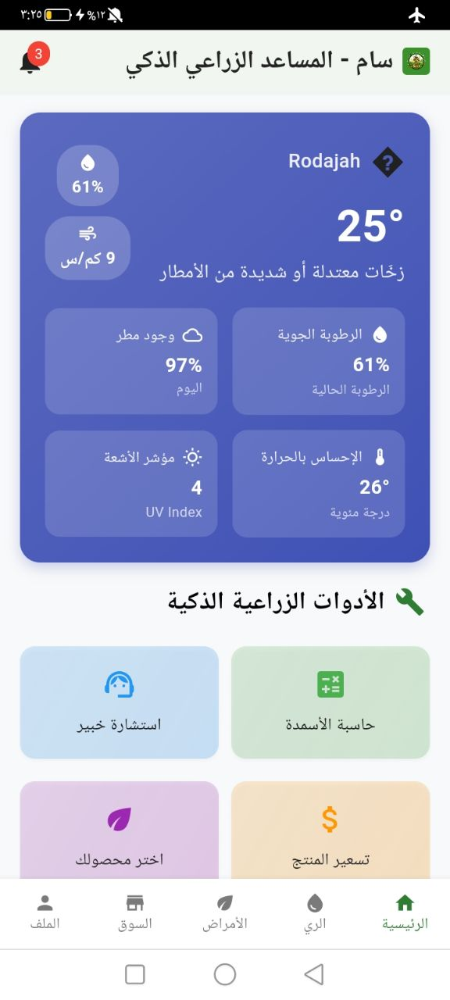
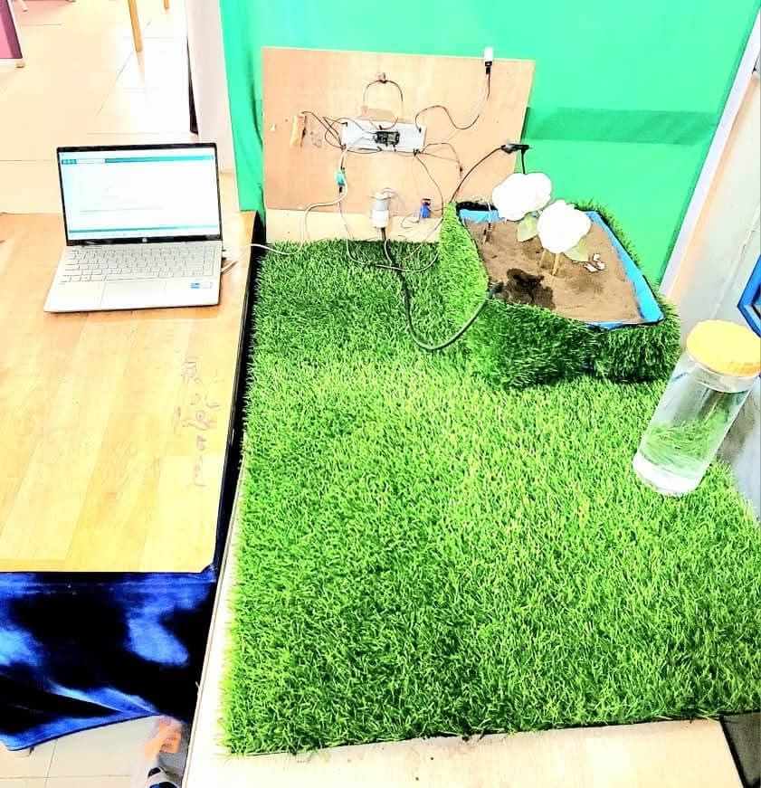

```markdown
# 🌿 SAM – Smart Agricultural Assistant

> **"Empowering farmers with smart tools, real-time insights, and a connected agricultural marketplace."**

---

## 📱 Overview

**SAM** is a comprehensive **smart agriculture mobile application** built with **Flutter**, designed to assist farmers and agricultural enthusiasts through:
- 🌾 Smart farming tools  
- 🛒 Integrated marketplace  
- 🌱 Plant health diagnostics  
- 💧 Intelligent irrigation control  

The app combines IoT, AI, and modern mobile design to make farming simpler, more efficient, and sustainable.

---

## 🖼️ Screenshots

| Home | Market | Plant | Profile |
|------|---------|--------|----------|
|  |  |  |  |

| Login | Circuit | Water Control |
|--------|----------|----------------|
|  |  |  |

---

## ⚙️ Features

### 🛒 Agricultural Marketplace
- Buy and sell agricultural products  
- Add listings with **images**, **descriptions**, and **pricing**  
- Chat directly with **buyers** and **sellers**  
- Manage **user profiles** and **your own product catalog**

### 💧 Smart Irrigation *(Coming Soon)*
- Monitor and control irrigation systems  
- Schedule watering times  
- Optimize water usage using **weather** and **soil** data  

### 🌿 Plant Disease Diagnosis *(Coming Soon)*
- Identify plant diseases using **AI-powered image recognition**  
- Receive **treatment suggestions**  
- Access a **database of common plant issues**

---

## 🧠 Technical Overview

**Built With**
- 🧩 **Flutter** – Cross-platform mobile framework  
- ☁️ **Supabase** – Backend-as-a-Service for:  
  - Authentication  
  - Cloud Firestore database  
  - Storage for images  
  - Cloud Functions  
- 🔄 **BLoC Pattern** – Robust state management  

---

## 📂 Project Structure

```bash
lib/
├── bloc/           # Business logic components
├── models/         # Data models
├── repositories/   # Data access layer
├── screens/        # App screens (UI)
└── widgets/        # Reusable UI components

assets/
├── home.jpg
├── market.jpg
├── plant.jpg
├── profile.jpg
├── login.jpg
├── circuit.jpg
└── water control.jpg
```

---

## 🚀 Getting Started

### 🧰 Prerequisites

- Flutter SDK (latest stable)
- Dart SDK
- Supabase account
- Android Studio / VS Code with Flutter extensions

### 📦 Installation

```bash
# 1. Clone the repository
git clone https://github.com/your-username/sam-agriculture.git
cd sam-agriculture

# 2. Install dependencies
flutter pub get

# 3. Run the app
flutter run
```

---

## 🧑‍💻 Usage

### 👤 User Authentication
- Sign up with email and password
- Log in securely
- Manage your profile

### 🛍️ Marketplace
- Browse and search for products
- Add your own listings with details and images
- Chat directly with other users
- Manage and edit your product listings

### 🌾 Smart Agriculture Tools
- Control water usage in Smart Irrigation
- Diagnose plant diseases with Plant Doctor (coming soon)

---

## 🗺️ Roadmap

- [ ] Implement advanced search & filters for the marketplace
- [ ] Add real-time notifications
- [ ] Integrate AI-powered disease recognition
- [ ] Connect IoT devices for smart irrigation
- [ ] Add weather forecasting for planning

---

## 🤝 Contributing

Contributions are welcome!

```bash
# 1. Fork the project

# 2. Create your branch
git checkout -b feature/amazing-feature

# 3. Commit your changes
git commit -m "Add amazing feature"

# 4. Push and open a Pull Request
git push origin feature/amazing-feature
```

---

## 📄 License

This project is licensed under the MIT License – see the LICENSE file for details.

---

## 📬 Contact

👨‍💻 Developer: Fahmi Fuad Al-Amere  
📧 fahmifuadalamere@gmail.com  
🔗 LinkedIn | GitHub

---

##
